# 🏎️ Rovo Sprint Strategist - Technical Architecture & Professional Charts

## 📋 Project Overview

**Rovo Sprint Strategist** is an AI-powered sprint management platform inspired by Formula 1 race strategy. Built on Atlassian Forge with Rovo AI integration, it transforms traditional sprint management into intelligent, data-driven decision making.

---

## 🏗️ System Architecture Diagram


---

## 🔄 Data Flow Architecture


---

## 🧩 Component Architecture


---

## 🤖 AI Integration Flow

```mermaid
flowchart TD
    UserQuery[User Query<br/>"What's blocking Sprint 42?"]
    
    RovoAgent{Rovo AI Agent<br/>Intent Detection}
    
    LocalAI[Free AI Service<br/>Local Processing]
    ClaudeAI[Anthropic Claude<br/>Advanced Analysis]
    
    SprintData[(Sprint Data<br/>Issues, Team, Metrics)]
    
    Analysis[AI Analysis<br/>Pattern Recognition]
    
    Response[Structured Response<br/>Insights + Actions]
    
    UserQuery --> RovoAgent
    
    RovoAgent --> LocalAI
    RovoAgent --> ClaudeAI
    
    LocalAI --> SprintData
    ClaudeAI --> SprintData
    
    SprintData --> Analysis
    
    Analysis --> Response
    
    Response --> UserQuery
    
    style LocalAI fill:#e1f5fe
    style ClaudeAI fill:#fff3e0
    style RovoAgent fill:#f3e5f5
```

---

## 📊 Database Schema


---

## 🔧 API Endpoints Architecture


---

## 🎯 Feature Integration Map


---

## 🚀 Deployment Architecture


---

## 🔄 Real-time Data Synchronization


---

## 🎨 UI/UX Component Hierarchy


---

## 🧠 AI Decision Making Flow


---

## 📈 Performance Metrics & KPIs


---

## 🔐 Security & Authentication Flow


---

## 🎮 Gamification System

```mermaid
graph TB
    subgraph "Achievement System"
        PolePosition[🏎️ Pole Position<br/>First to Complete]
        FastFinisher[⚡ Fast Finisher<br/>Ahead of Schedule]
        CleanCode[🧹 Clean Code<br/>Zero Bugs]
        TestChampion[🎯 Test Champion<br/>High Coverage]
        TeamPlayer[🤝 Team Player<br/>Helps Others]
        Streak[🔥 Streak Master<br/>Consistent Delivery]
    end
    
    subgraph "Scoring System"
        TaskCompletion[Task Completion<br/>+10 points/task]
        StoryPoints[Story Points<br/>+5 points/point]
        QualityBonus[Quality Bonus<br/>+20 points]
        SpeedBonus[Speed Bonus<br/>+15 points]
        HelpingBonus[Helping Bonus<br/>+25 points]
    end
    
    subgraph "Leaderboard"
        WeeklyRanking[Weekly Ranking<br/>Current Sprint]
        MonthlyRanking[Monthly Ranking<br/>Multiple Sprints]
        AllTimeRanking[All-Time Ranking<br/>Career Stats]
    end
    
    TaskCompletion --> PolePosition
    StoryPoints --> FastFinisher
    QualityBonus --> CleanCode
    SpeedBonus --> TestChampion
    HelpingBonus --> TeamPlayer
    
    PolePosition --> WeeklyRanking
    FastFinisher --> MonthlyRanking
    CleanCode --> AllTimeRanking
```



---

## 🔄 Integration Ecosystem


---

## 📊 Technical Specifications

### **Frontend Stack**
- **Framework**: React 18 with Hooks
- **Styling**: Tailwind CSS + Custom F1 Theme
- **Animations**: Framer Motion
- **3D Graphics**: Three.js + React Three Fiber
- **Charts**: Recharts
- **State Management**: Context API
- **Routing**: React Router v6

### **Backend Stack**
- **Runtime**: Node.js 20.x
- **Framework**: Express.js
- **Database**: SQLite (local) + Supabase (cloud)
- **AI Integration**: Anthropic Claude + Local AI
- **Authentication**: Atlassian OAuth 2.0
- **API**: RESTful with JSON responses

### **Atlassian Integration**
- **Platform**: Atlassian Forge
- **Rovo**: AI Agents + Actions
- **Triggers**: Webhook-based events
- **Storage**: Forge Storage API
- **Permissions**: Scoped access control

### **Deployment**
- **Frontend**: Vercel (Edge Functions)
- **Backend**: Vercel Serverless
- **Database**: Supabase (PostgreSQL)
- **CDN**: Vercel Edge Network
- **Monitoring**: Built-in analytics

---

## 🎯 Key Features Summary

| Feature | Technology | Purpose |
|---------|------------|---------|
| **Real-time Dashboard** | React + Three.js | Sprint health visualization |
| **AI Chat Assistant** | Rovo Agent + Claude | Natural language queries |
| **Pit-Stop Recommendations** | AI Analysis | Proactive sprint adjustments |
| **Team Workload Analysis** | Data visualization | Capacity planning |
| **Gamification System** | Achievement engine | Team motivation |
| **Jira Integration** | REST API + Webhooks | Real-time data sync |
| **Predictive Analytics** | Machine learning | Risk assessment |
| **Mobile Responsive** | Tailwind CSS | Cross-device access |

---

## 🏆 Competitive Advantages

1. **F1-Inspired UX**: Unique racing theme with professional telemetry interface
2. **AI-First Approach**: Proactive recommendations vs reactive reporting
3. **Real-time Intelligence**: Live data sync with predictive insights
4. **Gamification**: Motivational system for developer engagement
5. **Atlassian Native**: Deep integration with existing workflows
6. **Zero Configuration**: Works out-of-the-box with any Jira project
7. **Scalable Architecture**: Handles teams from 5 to 500+ members

---

*Built with ❤️ for **Codegeist 2025** - Transforming Sprint Management with AI Intelligence*