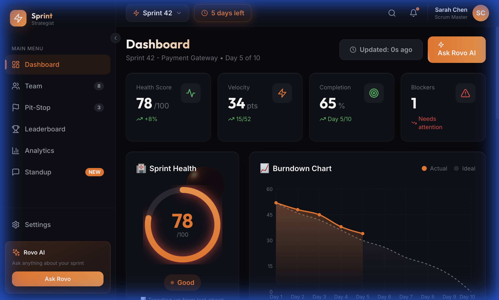

# 📖 Rovo Sprint Strategist - User Guide

## 🏎️ Welcome to Sprint Strategist!

Your AI-powered sprint intelligence platform inspired by Formula 1 race strategy. This guide will walk you through all features with step-by-step instructions.

---

## 📋 Table of Contents

1. [Getting Started](#-getting-started)
2. [Dashboard Overview](#-dashboard-overview)
3. [Team Management](#-team-management)
4. [Pit-Stop Recommendations](#-pit-stop-recommendations)
5. [Leaderboard & Gamification](#-leaderboard--gamification)
6. [Analytics & Insights](#-analytics--insights)
7. [Daily Standup](#-daily-standup)
8. [Settings](#-settings)
9. [Test Scenarios](#-test-scenarios)

---

## 🚀 Getting Started

### Prerequisites
- Modern web browser (Chrome, Firefox, Safari, Edge)
- Active sprint in your Jira project

### Accessing the Application

1. **Open the Application**
   - Navigate to: `http://localhost:3000` (development)
   - Or your deployed URL

2. **Initial Load**
   - The dashboard will automatically load your active sprint data
   - Watch the loading animations as data is fetched



---

## 📊 Dashboard Overview

The Dashboard is your mission control center, displaying real-time sprint health metrics.

### Key Metrics Display

| Metric | Description | Location |
|--------|-------------|----------|
| **Health Score** | Overall sprint health (0-100) | Top left card |
| **Velocity** | Current sprint velocity in points | Second card |
| **Completion** | Percentage of work completed | Third card |
| **Blockers** | Number of blocked issues | Fourth card |

### Dashboard Components

1. **Health Gauge** 🏥
   - Visual circular gauge showing sprint health
   - Green (70-100): Healthy
   - Yellow (50-69): Caution
   - Red (0-49): Critical

2. **Velocity Chart** 📈
   - Line chart showing velocity trend
   - Compare with committed vs completed

3. **Sprint Progress** 📊
   - Burndown-style progress visualization
   - Shows ideal vs actual progress

4. **Risk Radar** ⚠️
   - Identifies potential risks
   - Categorizes by severity

5. **Team Activity** 👥
   - Recent team actions
   - Real-time activity feed

6. **Quick Actions** ⚡
   - One-click access to common tasks
   - Generate standup, view pit-stop, etc.

### How to Use

**Step 1:** Review the top metrics cards for a quick status overview

**Step 2:** Check the Health Score gauge - if below 70, investigate the Risk Radar

**Step 3:** Use the "Updated: Xs ago" button to manually refresh data

**Step 4:** Click "Ask Rovo AI" for natural language queries about your sprint


---

## 👥 Team Management

View your team members, their workload, and capacity distribution.

### Team Page Features

1. **Team Members List**
   - Profile pictures with avatars
   - Roles and responsibilities
   - Current capacity status

2. **Workload Distribution**
   - Visual capacity bars
   - Color-coded by load level:
     - 🟢 Green: Under capacity (< 80%)
     - 🟡 Yellow: At capacity (80-100%)
     - 🔴 Red: Overloaded (> 100%)

3. **Assigned Issues**
   - Quick view of each member's tasks
   - Story points breakdown

### How to Use

**Step 1:** Click "Team" in the sidebar navigation

**Step 2:** Review each team member's workload bar

**Step 3:** Identify overloaded team members (red bars)

**Step 4:** Consider reassigning tasks from overloaded members


---

## 🔧 Pit-Stop Recommendations

AI-powered suggestions for mid-sprint adjustments, just like F1 pit-stop strategy!

### Recommendation Types

| Type | Icon | Description |
|------|------|-------------|
| **Remove Scope** | 🎯 | Suggest moving low-priority items to next sprint |
| **Reassign** | 🔄 | Recommend reassigning tasks for balance |
| **Split Task** | ✂️ | Break large tasks into smaller ones |
| **Escalate** | 🚨 | Flag issues needing management attention |

### Urgency Levels

- **Normal** (🟢): Health score > 70%
- **High** (🟡): Health score 50-70%
- **Critical** (🔴): Health score < 50%

### How to Use

**Step 1:** Click "Pit-Stop" in the sidebar

**Step 2:** Review the urgency level indicator at the top

**Step 3:** Read each AI recommendation carefully

**Step 4:** Click "Apply" to accept a recommendation

**Step 5:** Click "Dismiss" to ignore a recommendation

**Step 6:** Recommendations update automatically as sprint progresses


---

## 🏆 Leaderboard & Gamification

Make sprints fun with F1-inspired achievements and friendly competition!

### Leaderboard Rankings

Team members are ranked by:
- Completed story points
- Completion rate
- Quality (no bugs)
- Helping teammates

### Achievement Badges

| Badge | Name | How to Earn |
|-------|------|-------------|
| 🏎️ | Pole Position | First to complete all assigned tasks |
| ⚡ | Fast Finisher | Complete tasks ahead of schedule |
| 🧹 | Clean Code | Zero bugs reported |
| 🎯 | Test Champion | Highest test coverage |
| 🔧 | Pit Crew | Help unblock teammates |
| 🔥 | Streak Master | Complete tasks 5 days in a row |

### How to Use

**Step 1:** Click "Leaderboard" in the sidebar

**Step 2:** View your team's current rankings

**Step 3:** Check recently earned achievements

**Step 4:** Celebrate top performers!


---

## 📈 Analytics & Insights

Deep dive into historical data, trends, and predictions.

### Available Charts

1. **Velocity Trend**
   - Compare velocity across last 5 sprints
   - See committed vs completed

2. **Issue Distribution**
   - Pie chart of issue statuses
   - Done, In Progress, To Do, Blocked

3. **Team Performance**
   - Individual efficiency metrics
   - Points completed per person

4. **Health Trend**
   - Daily health score changes
   - Identify patterns

### Key Insights

- **Average Velocity**: Historical team velocity
- **Velocity Change**: Trend direction (↑ improving, ↓ declining)
- **Estimation Accuracy**: How accurate are your estimates
- **Sprint Success Rate**: Percentage of sprints meeting goals

### How to Use

**Step 1:** Click "Analytics" in the sidebar

**Step 2:** Review the velocity trend chart for patterns

**Step 3:** Check team performance to identify training needs

**Step 4:** Use insights to improve future sprint planning


---

## 📢 Daily Standup

AI-generated daily standup summaries - save 15 minutes every day!

### Standup Sections

1. **Completed Yesterday** ✅
   - Auto-detected from issue transitions
   - Shows who completed what

2. **In Progress Today** 🔄
   - Current work items
   - Flags at-risk items

3. **Blockers Detected** 🚫
   - Automatically identified blockers
   - Shows how long each has been blocked

4. **AI Summary** 🤖
   - Natural language overview
   - Key highlights and concerns

### How to Use

**Step 1:** Click "Standup" in the sidebar

**Step 2:** Review the auto-generated standup for today

**Step 3:** Use this in your daily standup meeting

**Step 4:** Click "History" to see previous standups

**Step 5:** Copy content for Slack/Teams if needed


---

## ⚙️ Settings

Customize your Sprint Strategist experience.

### Available Settings

| Setting | Description | Default |
|---------|-------------|---------|
| **Notifications** | Enable/disable alerts | On |
| **Email Alerts** | Receive email notifications | On |
| **Slack Alerts** | Post to Slack channel | Off |
| **Alert Threshold** | Health score to trigger alerts | 60 |
| **Theme** | UI theme (dark/light) | Dark |
| **Language** | Interface language | English |

### How to Use

**Step 1:** Click "Settings" in the sidebar

**Step 2:** Toggle settings as needed

**Step 3:** Adjust the alert threshold slider

**Step 4:** Click "Save Settings" to apply changes


---

## 🧪 Test Scenarios

### Scenario 1: Daily Sprint Review

**Goal:** Quickly assess sprint health and identify issues

**Steps:**
1. Open Dashboard → Check Health Score
2. If Health < 70 → Go to Pit-Stop for recommendations
3. Review Risk Radar for blocking issues
4. Check Team workload distribution
5. Generate Standup for team meeting

**Expected Results:**
- Health Score displays (e.g., 78/100)
- Velocity shows current progress (e.g., 34 pts)
- Team members visible with workload

---

### Scenario 2: Mid-Sprint Adjustment

**Goal:** Apply AI recommendations to improve sprint outcome

**Steps:**
1. Go to Pit-Stop page
2. Review AI recommendations
3. Click "Apply" on first recommendation
4. Verify the recommendation status changes
5. Check if Health Score improves on Dashboard

**Expected Results:**
- At least 1 recommendation displayed
- Apply button works
- Recommendation marked as "Applied"

---

### Scenario 3: Team Performance Review

**Goal:** Analyze team performance and achievements

**Steps:**
1. Go to Leaderboard page
2. Note top 3 performers
3. Check earned badges
4. Go to Analytics page
5. Review team performance chart

**Expected Results:**
- 5+ team members on leaderboard
- Badges displayed with icons
- Performance chart shows all team members

---

### Scenario 4: Generate Standup Report

**Goal:** Create automated daily standup

**Steps:**
1. Go to Standup page
2. Wait for standup to generate
3. Review completed items section
4. Check blockers section
5. Read AI summary

**Expected Results:**
- Day number displayed (e.g., Day 5)
- Completed items listed with assignees
- Blockers shown if any exist

---

### Scenario 5: Configure Alerts

**Goal:** Customize notification settings

**Steps:**
1. Go to Settings page
2. Toggle Email Alerts Off
3. Change Alert Threshold to 50
4. Click Save Settings
5. Verify settings saved message

**Expected Results:**
- Email Alerts toggle switches off
- Threshold slider moves to 50
- Success message appears

---

## 🔑 Keyboard Shortcuts

| Shortcut | Action |
|----------|--------|
| `D` | Go to Dashboard |
| `T` | Go to Team |
| `P` | Go to Pit-Stop |
| `L` | Go to Leaderboard |
| `A` | Go to Analytics |
| `S` | Go to Standup |
| `R` | Refresh data |

---

## 🆘 Troubleshooting

### Data Not Loading
1. Check if API server is running (`http://localhost:3001/api/health`)
2. Verify Supabase connection in `.env`
3. Refresh the page

### Health Score Shows 0
1. Ensure sprint has active issues
2. Check database has seed data
3. Restart backend server

### Recommendations Not Appearing
1. AI service may be in fallback mode
2. Check console for errors
3. Recommendations generate when health < 80

---

## 📞 Support

- **GitHub Issues:** [Report a bug](https://github.com/samarabdelhameed/rovo-sprint-strategist/issues)
- **Documentation:** See `README.md` for technical details
- **Deployment:** See `DEPLOYMENT_GUIDE.md` for setup

---

## 🏁 Quick Reference Card

```
┌─────────────────────────────────────────────────────────────┐
│                    SPRINT STRATEGIST                         │
├─────────────────────────────────────────────────────────────┤
│                                                              │
│  📊 Dashboard    - Real-time sprint health                  │
│  👥 Team         - Workload & capacity                      │
│  🔧 Pit-Stop     - AI recommendations                       │
│  🏆 Leaderboard  - Gamification & badges                    │
│  📈 Analytics    - Trends & insights                        │
│  📢 Standup      - Auto-generated reports                   │
│  ⚙️ Settings     - Customize experience                     │
│                                                              │
│  Health Score Guide:                                         │
│  🟢 70-100 = Healthy   🟡 50-69 = Caution   🔴 0-49 = Critical │
│                                                              │
└─────────────────────────────────────────────────────────────┘
```

---

Made with 🏎️ for **Codegeist 2025**
